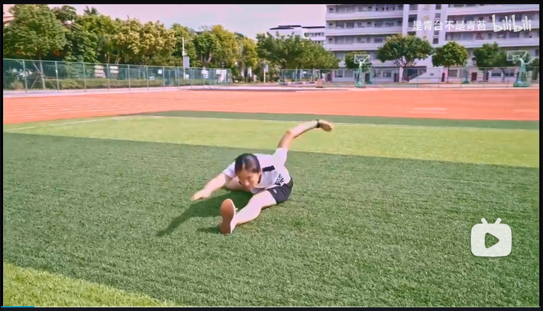
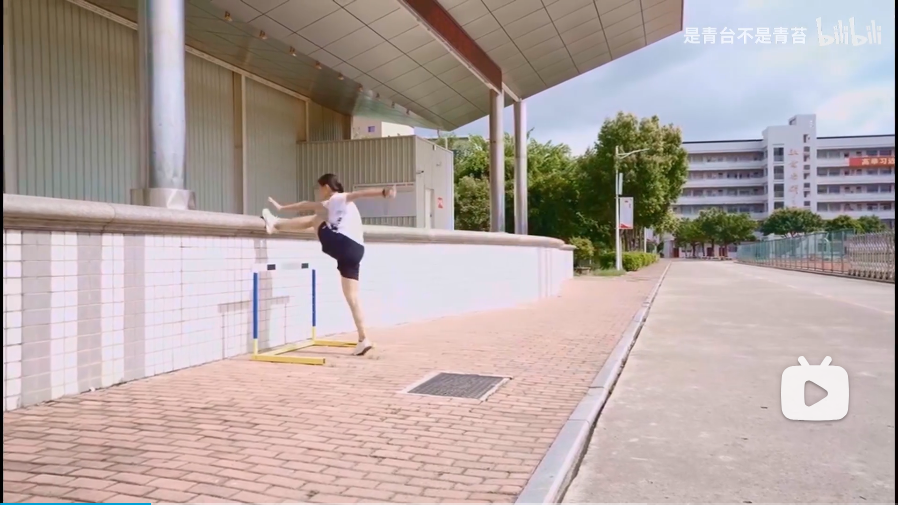
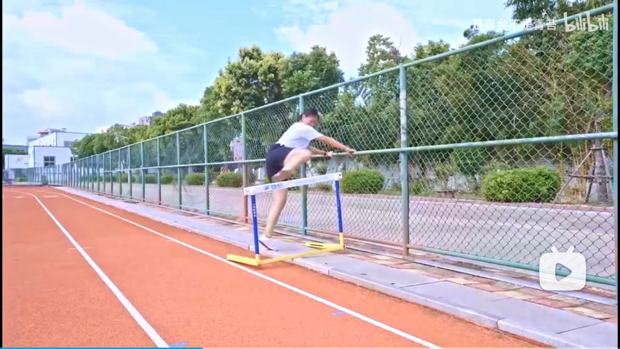
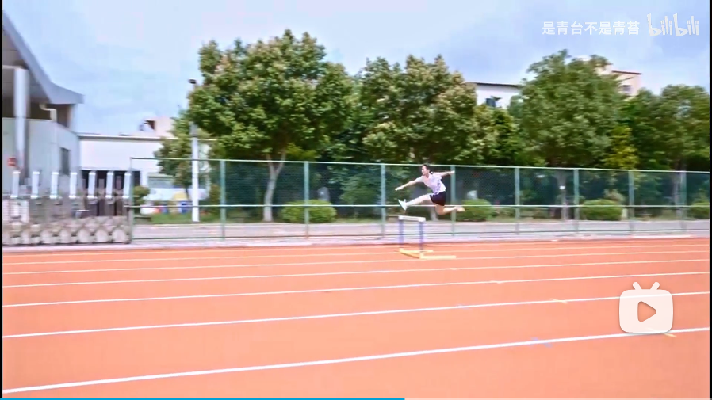
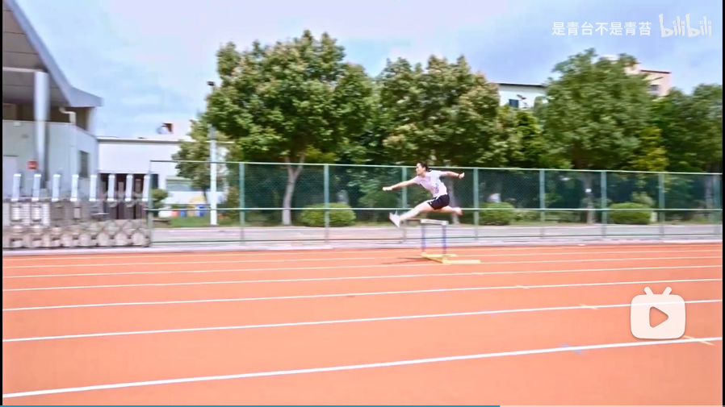
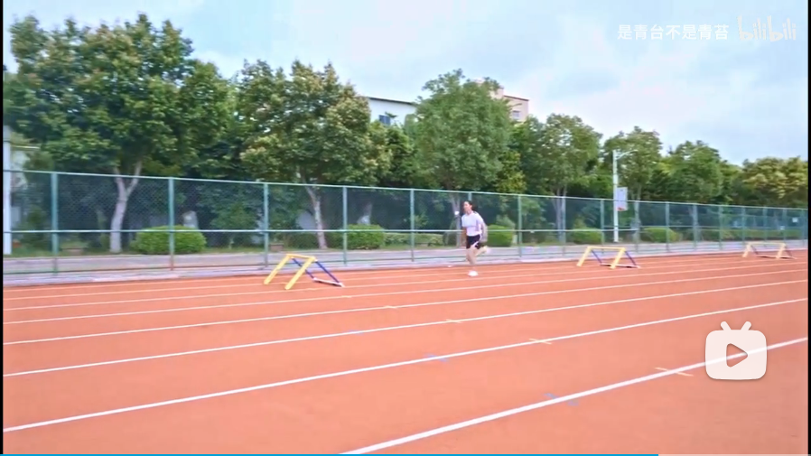

# 110栏训练

1 跨栏坐与坐姿下攻栏

<figure markdown="span">
  
  <figcaption>跨栏坐与坐姿下攻栏</figcaption>
</figure>

2 对墙做攻栏练习

<figure markdown="span">
  
  <figcaption>对墙做攻栏练习</figcaption>
</figure>

3 手扶墙做起跨栏练习

<figure markdown="span">
  
  <figcaption>手扶墙做起跨栏练习</figcaption>
</figure>

4 行进间动作模拟攻栏和起跨栏练习

<figure markdown="span">
  
  <figcaption>行进间动作模拟攻栏和起跨栏练习</figcaption>
</figure>

5 行进间做攻侧栏练习

<figure markdown="span">
  
  <figcaption>行进间做攻侧栏练习</figcaption>
</figure>

6 行进间做过侧栏练习

<figure markdown="span">
  
  <figcaption>行进间做过侧栏练习</figcaption>
</figure>

7 过低栏栏间跑练习

<figure markdown="span">
  
  <figcaption>过低栏栏间跑练习</figcaption>
</figure>

8 完整过五个栏架练习
（5步向3步过渡）